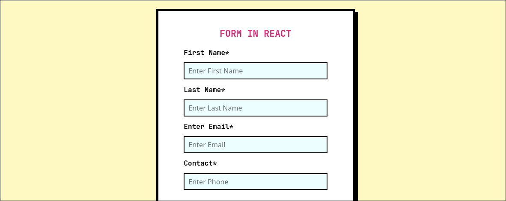

# React + Vite

This is a very simple project that creates a template of a form that uses the hook useForm of react to do the validations and regular expressions, you can clone this project and download a local folder and implement it in another project.

